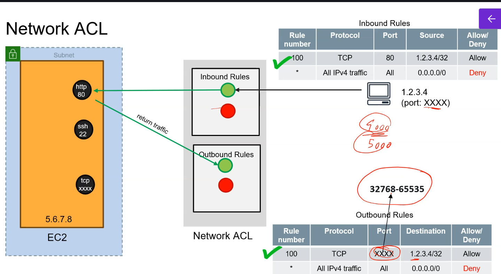

Las Network Access Control List (NACL) o Lista de Control de Acceso tienen las siguientes caracteristicas

Pasted image 20250529234012.png])
- Son a nivel de Subnet
- Contiene Reglas de permisos y de denegación, las reglas son numeradas (la primera regla que aplique con el trafico esa se dará sea de Allow/Deny)
- Las reglas se evaluan en orden (1 - 32766) - Se recomienda dejar cierto espacio para poder poner reglas intermedias
- El trafico es sin estado - quiere decir que el trafico saliente no está permitido por defecto como en los SG - Se necesita abrir explicitamente los puertos para el retorno de tráfico.
- Cada vez que se cree un subred, AWS va a crear una NACL por defecto y lo asociará a la subnet (defaul: all inbound and outbound)
- La NACL permite bloquear Ips especificas en un nivel de subnet

| # Rule |       Type       | Protocol | Port |      Source       |                    Allow/Deny                     |
| :----: | :--------------: | :------: | :--: | :---------------: | :-----------------------------------------------: |
|  100   | All IPv4 traffic |   All    | All  | 180.151.138.43/32 |   DENY   |
|  101   |      HTTPS       |   TCP    | 443  |     0.0.0.0/0     |     Allow      |
|   *    | All IPv4 traffic |   All    | All  |     0.0.0.0/0     |      DENY      |

En las NACL siempre hay una regla de Oro, es que la ultima regla sea con * y que sea de denegar todo el trafico entrante y saliente, así que si no se le da permiso explícito al final lo va a denegar

se le puso al puerto de salida xxxx porque tomaría un puerto efimero al azar de la maquia que puede ser en el rango 32768-65535 - si quieres todos pones ALL

### Flujo saliendo del servidor

Diferencias entre SG y NETWORK

| Security Group                                             | Network ACL                                                                                   |
| ---------------------------------------------------------- | --------------------------------------------------------------------------------------------- |
| Opera a nivel de Ec2 o Nivel de ENI                        | Opera a Nive de Subnet                                                                        |
| Soporta sólo reglas de permisos (ALLOW)                    | Soporta ambas Permiso y Denegación (ALLOW/DENY)                                               |
| Con estado - El tráfico de regreso está permitido          | Sin Estado - El Tráficp de retorno necesita de permisos                                       |
| Todas las reglas son evaluadas antes de tomar una decisión | Las reglas son evaluadas en orden (del más bajo al mayor) y el primero que cumple es aplicado |
